# Repository Technology Graph

High-level technologies per package/repository.

## Mermaid Graph

```mermaid
graph LR
  %% Modules
  subgraph Modules
    m_docs["docs\n(docs)"]
    m_adapters_graphql_yoga["@aexol/axolotl-graphql-yoga\n(adapters/graphql-yoga)"]
    m_root["@aexol/axolotl-engine\n(.)"]
    m_examples_yoga_federated["yoga-federated\n(examples/yoga-federated)"]
    m_packages_core["@aexol/axolotl-core\n(packages/core)"]
    m_packages_config["@aexol/axolotl-config\n(packages/config)"]
    m_packages_cli["@aexol/axolotl\n(packages/cli)"]
    m_packages_scripts["@aexol/axolotl-scripts\n(packages/scripts)"]
  end
  %% Technologies
  subgraph Technologies
    t_aexol_axolotl["@aexol/axolotl"]
    t_aexol_axolotl_config["@aexol/axolotl-config"]
    t_aexol_axolotl_core["@aexol/axolotl-core"]
    t_modelcontextprotocol_sdk["@modelcontextprotocol/sdk"]
    t_autoprefixer["autoprefixer"]
    t_chalk["chalk"]
    t_chokidar["chokidar"]
    t_clipboardy["clipboardy"]
    t_commander["commander"]
    t_config_maker["config-maker"]
    t_eslint["ESLint"]
    t_glob["glob"]
    t_globals["globals"]
    t_graphql["GraphQL"]
    t_graphql_yoga["GraphQL Yoga"]
    t_jest["Jest"]
    t_jiti["jiti"]
    t_next_js["Next.js"]
    t_nextra["nextra"]
    t_nextra_theme_docs["nextra-theme-docs"]
    t_node_fetch["node-fetch"]
    t_nodemon["nodemon"]
    t_openai["openai"]
    t_ora["ora"]
    t_playwright["Playwright"]
    t_postcss["postcss"]
    t_prettier["Prettier"]
    t_react["React"]
    t_sass["sass"]
    t_tailwindcss["tailwindcss"]
    t_ts_node["ts-node"]
    t_ts_patch["ts-patch"]
    t_tsx["tsx"]
    t_typescript["TypeScript"]
    t_typescript_transform_paths["typescript-transform-paths"]
    t_wrangler["wrangler"]
    t_ws["ws"]
  end
  %% Module -> Technology edges
  m_docs-->t_next_js
  m_docs-->t_nextra
  m_docs-->t_nextra_theme_docs
  m_docs-->t_react
  m_docs-->t_sass
  m_docs-->t_autoprefixer
  m_docs-->t_postcss
  m_docs-->t_tailwindcss
  m_docs-->t_typescript
  m_adapters_graphql_yoga-->t_graphql
  m_adapters_graphql_yoga-->t_aexol_axolotl_core
  m_adapters_graphql_yoga-->t_graphql_yoga
  m_root-->t_sass
  m_root-->t_typescript
  m_root-->t_graphql
  m_root-->t_node_fetch
  m_root-->t_ws
  m_root-->t_eslint
  m_root-->t_glob
  m_root-->t_jest
  m_root-->t_jiti
  m_root-->t_prettier
  m_root-->t_ts_node
  m_root-->t_ts_patch
  m_root-->t_tsx
  m_root-->t_typescript_transform_paths
  m_root-->t_wrangler
  m_examples_yoga_federated-->t_typescript
  m_examples_yoga_federated-->t_aexol_axolotl_core
  m_examples_yoga_federated-->t_graphql_yoga
  m_examples_yoga_federated-->t_graphql
  m_examples_yoga_federated-->t_node_fetch
  m_examples_yoga_federated-->t_ws
  m_examples_yoga_federated-->t_eslint
  m_examples_yoga_federated-->t_jiti
  m_examples_yoga_federated-->t_prettier
  m_examples_yoga_federated-->t_ts_patch
  m_examples_yoga_federated-->t_tsx
  m_examples_yoga_federated-->t_typescript_transform_paths
  m_examples_yoga_federated-->t_aexol_axolotl
  m_examples_yoga_federated-->t_nodemon
  m_examples_yoga_federated-->t_globals
  m_examples_yoga_federated-->t_playwright
  m_packages_core-->t_graphql
  m_packages_config-->t_config_maker
  m_packages_cli-->t_aexol_axolotl_core
  m_packages_cli-->t_graphql
  m_packages_cli-->t_aexol_axolotl_config
  m_packages_cli-->t_modelcontextprotocol_sdk
  m_packages_cli-->t_chalk
  m_packages_cli-->t_chokidar
  m_packages_cli-->t_clipboardy
  m_packages_cli-->t_commander
  m_packages_cli-->t_openai
  m_packages_cli-->t_ora
  %% Module -> Module edges (internal dependencies)
  m_adapters_graphql_yoga-->m_packages_core
  m_examples_yoga_federated-->m_packages_core
  m_examples_yoga_federated-->m_adapters_graphql_yoga
  m_examples_yoga_federated-->m_packages_cli
  m_packages_cli-->m_packages_config
  m_packages_cli-->m_packages_core
```

## @aexol/axolotl-engine (.)
- ESLint: @eslint/js, @typescript-eslint/eslint-plugin, @typescript-eslint/parser, eslint, eslint-config-prettier, eslint-plugin-prettier, typescript-eslint
- glob: glob
- GraphQL: graphql
- Jest: jest
- jiti: jiti
- node-fetch: node-fetch
- Prettier: prettier
- sass: sass
- ts-node: ts-node
- ts-patch: ts-patch
- tsx: tsx
- TypeScript: typescript
- typescript-transform-paths: typescript-transform-paths
- wrangler: wrangler
- ws: ws

## @aexol/axolotl-graphql-yoga (adapters/graphql-yoga)
- @aexol/axolotl-core: @aexol/axolotl-core
- GraphQL: @graphql-tools/utils, graphql
- GraphQL Yoga: graphql-yoga

## docs (docs)
- autoprefixer: autoprefixer
- Next.js: next
- nextra: nextra
- nextra-theme-docs: nextra-theme-docs
- postcss: postcss
- React: react, react-dom
- sass: sass
- tailwindcss: tailwindcss
- TypeScript: typescript

## yoga-federated (examples/yoga-federated)
- @aexol/axolotl: @aexol/axolotl
- @aexol/axolotl-core: @aexol/axolotl-core
- ESLint: @eslint/js, @typescript-eslint/eslint-plugin, @typescript-eslint/parser, eslint, eslint-config-prettier, eslint-plugin-prettier, typescript-eslint
- globals: globals
- GraphQL: @aexol/axolotl-graphql-yoga, graphql
- GraphQL Yoga: graphql-yoga
- jiti: jiti
- node-fetch: node-fetch
- nodemon: nodemon
- Playwright: playwright
- Prettier: prettier
- ts-patch: ts-patch
- tsx: tsx
- TypeScript: typescript
- typescript-transform-paths: typescript-transform-paths
- ws: ws

## @aexol/axolotl (packages/cli)
- @aexol/axolotl-config: @aexol/axolotl-config
- @aexol/axolotl-core: @aexol/axolotl-core
- @modelcontextprotocol/sdk: @modelcontextprotocol/sdk
- chalk: chalk
- chokidar: chokidar
- clipboardy: clipboardy
- commander: commander
- GraphQL: graphql-js-tree, graphql-zeus-core
- openai: openai
- ora: ora

## @aexol/axolotl-config (packages/config)
- config-maker: config-maker

## @aexol/axolotl-core (packages/core)
- GraphQL: @graphql-tools/utils, graphql, graphql-js-tree

## @aexol/axolotl-scripts (packages/scripts)
- (no recognized technologies)
