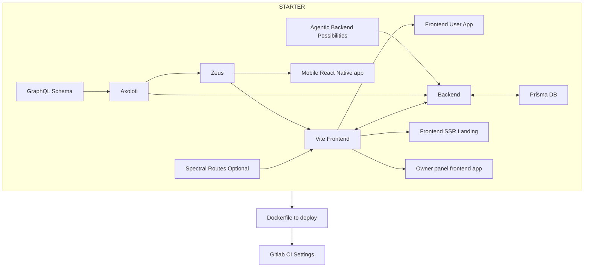

```mermaid
flowchart TB
    subgraph STARTER
        APP[Frontend User App]
        B[Backend]
        DB[Prisma DB]
        LAN[Frontend SSR Landing]
        MOB[Mobile React Native app]
        OPP[Owner panel frontend app]
        VITE[Vite Frontend]
        AGENT[Agentic Backend Possibilities]
        Z[Zeus]
        Z --> VITE
        AX --> Z
        Z --> MOB
        AX[Axolotl]
        AGENT --> B
        AX --> B
        B <--> DB
        VITE <--> B
        VITE --> LAN
        VITE --> APP
        VITE --> OPP
        G[GraphQL Schema]
        G --> AX
        SR[Spectral Routes Optional]
        SR --> VITE
    end
    DOCKER[Dockerfile to deploy]
    CI[Gitlab CI Settings]
    STARTER --> DOCKER
    DOCKER --> CI
```