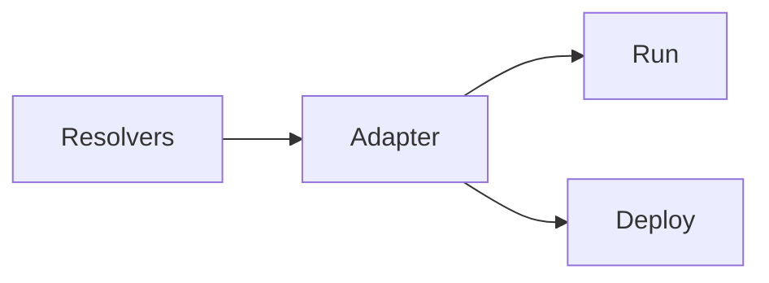

import Logo from '../components/logo';

<div style={{display:'flex', flexDirection:"column", alignItems:"center", gap:"2rem", padding:"2rem"}}>
<Logo />
<h1 style={{fontSize:'4rem', textAlign:"center", lineHeight:1.25}}>Axolotl</h1>
</div>
This is super alpha version of universal backend( or frontend if you want to create something special) framework ensuring **GraphQL** Resolvers and arguments **type-safety**. 

## 😮 What?

Axolotl is a framework overlord/wrapper to forget about type-casting and looking into schema. With it you can just forget about those 😉
- ⚙️ models generate runtime on dev providing type safety
- 🏃 migrate between different GraphQL Servers
- 🧐 write your own adapters for different purposes
- 😂 easy to setup,start and integrate
- 🫡 from GraphQL Editor and Aexol teams
- 🪦 No RIP we will maintain forever

## 🫠 How?

Axolotl provides type-safety and it is up to you to choose an adapter (or write your own). And develop your GraphQL thing super-fast. How it runs it depends what framework you choose under the hood. I am starting with `stucco` adapter which is Golang compiled backend running in TS

```ts filename="index.ts"
// choose your adapter
const { applyMiddleware, createResolvers } = Axolotl(yourAdapter)<Models>({
  modelsPath: './src/models.ts',
  schemaPath: './schema.graphql',
});

const resolvers = createResolvers({
  Query: {
    hello: () => "World"
  },
});
```

```graphql filename="schema.graphql"
type Query{
    hello: String!
}
```
## 🤔 Why? 

Writing GraphQL for backend developers is still complicated when you want to go schema-first instead of code-first. Moreover I felt like we need an **evolutionary** framework. 

For example using `apollo-server` but want to switch to `graphql-yoga` ? No problem just change an adapter. 

Want to experiment with `stucco-js` with Go lang core? No problem change the adapter. 

Want to set up every part of your system in different graphql server with microservices?. No problem.

## 🤯 Graph
So you can write resolvers usually just once and then easily migrate to other GraphQL Server, Deploy, etc.

## 🧌 Who?

Me [aexol](https://github.com/aexol) is the author of the lib. I was in the type-safety rabbit hole while building [GraphQL Zeus](https://github.com/graphql-editor/graphql-zeus) a GraphQL Client downloaded almost Million of times. While maintaining zeus and developing together with all-the-time changing TypeScript is really hard. I discovered - I can write something simpler - much powerful, that community needs, that integrates with everything - using the same knowledge.

## 🫂 Community

[Discord](https://discord.gg/f8SfgGBHRz)